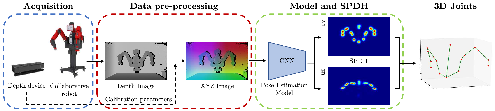

# Semi-Perspective Decoupled Heatmaps for 3D Robot Pose Estimation from Depth Maps

This is the official PyTorch implementation of the publication:

*A. Simoni, S. Pini, G. Borghi, R. Vezzani* </br>
**Semi-Perspective Decoupled Heatmaps for 3D Robot Pose Estimation from Depth Maps** </br>
*In IEEE Robotics and Automation Letters (RA-L), 2022*

<p align="center" width="100%">
  
</p>

<p style="text-align: justify">
Knowing the exact 3D location of workers and
robots in a collaborative environment enables several real
applications, such as the detection of unsafe situations or the
study of mutual interactions for statistical and social purposes.
In this paper, we propose a non-invasive and light-invariant
framework based on depth devices and deep neural networks
to estimate the 3D pose of robots from an external camera.
The method can be applied to any robot without requiring
hardware access to the internal states. We introduce a novel
representation of the predicted pose, namely Semi-Perspective
Decoupled Heatmaps (SPDH), to accurately compute 3D joint
locations in world coordinates adapting efficient deep networks
designed for the 2D Human Pose Estimation. The proposed
approach, which takes as input a depth representation based
on XYZ coordinates, can be trained on synthetic depth data and
applied to real-world settings without the need for domain adaptation
techniques. To this end, we present the SimBa dataset,
based on both synthetic and real depth images, and use it for
the experimental evaluation. Results show that the proposed
approach, made of a specific depth map representation and the
SPDH, overcomes the current state of the art.
</p>

## Getting Started

We tested the approach with Python 3.6.13, PyTorch 1.8.1, TorchVision 0.9.1 and CudaToolkit 10.2.

### Environment

Create your Python environment and install the required packages with the following commands:

```bash
conda create -n <env_name>
conda activate <env_name>
pip install -r requirements.txt
```

Install [PyTorch](https://pytorch.org/)>=1.8.1 and TorchVision>=0.9.1.<br>

## SimBa dataset
For downloading the dataset, please use the links on the [dataset webpage](https://aimagelab.ing.unimore.it/go/simba).

## SPDH

### Training
Run the following script:
```bash
python train_spdh.py --config <path-to-config> --results_dir <path-to-save-log-and-weights>
```

### Testing with pre-trained weights
Original paper experiments can be reproduced as follows:
1) Download config and pre-trained weights from [Model Zoo](networks/MODELZOO.md).
2) Run the testing script as follows:

```bash
python test_spdh.py --config <path-to-config> --resume <path-to-weights>
```

[//]: # (## Competitors)

[//]: # ()
[//]: # (For training and testing, please follow the same instruction for SPDH method. Use the following scripts to train the corresponding competitor )

[//]: # (in Table 1 of the paper:)

[//]: # ()
[//]: # (```bash)

[//]: # (train_2D_baselines.py   -->   Training of "2D to 3D from depth" approaches)

[//]: # (train_3D_regression.py  -->   Training of "3D regression" &#40;ResNet18&#41; approach)

[//]: # (train_martinez.py       -->   Training of "2D to 3D lifting" approach)

[//]: # (train_volumetric.py     -->   Training of "Volumetric heatmaps" approach)

[//]: # (```)

## Authors
* **Alessandro Simoni** - [alexj94](https://github.com/alexj94)
* **Stefano Pini** - [stefanopini](https://github.com/stefanopini)
* **Guido Borghi** - [gdubrg](https://github.com/gdubrg)
* **Roberto Vezzani** - [robervez](https://github.com/robervez)

## Citation
If you find this repository useful for your research, please cite the following paper:
```bibtex
@article{simoni2022semi,
  title={Semi-Perspective Decoupled Heatmaps for 3D Robot Pose Estimation from Depth Maps},
  author={Simoni, Alessandro and Pini, Stefano and Borghi, Guido and Vezzani, Roberto},
  journal={IEEE Robotics and Automation Letters},
  year={2022},
  publisher={IEEE}
}
```

## License
This project is licensed under the MIT License - see the [LICENSE](LICENSE) file for detail